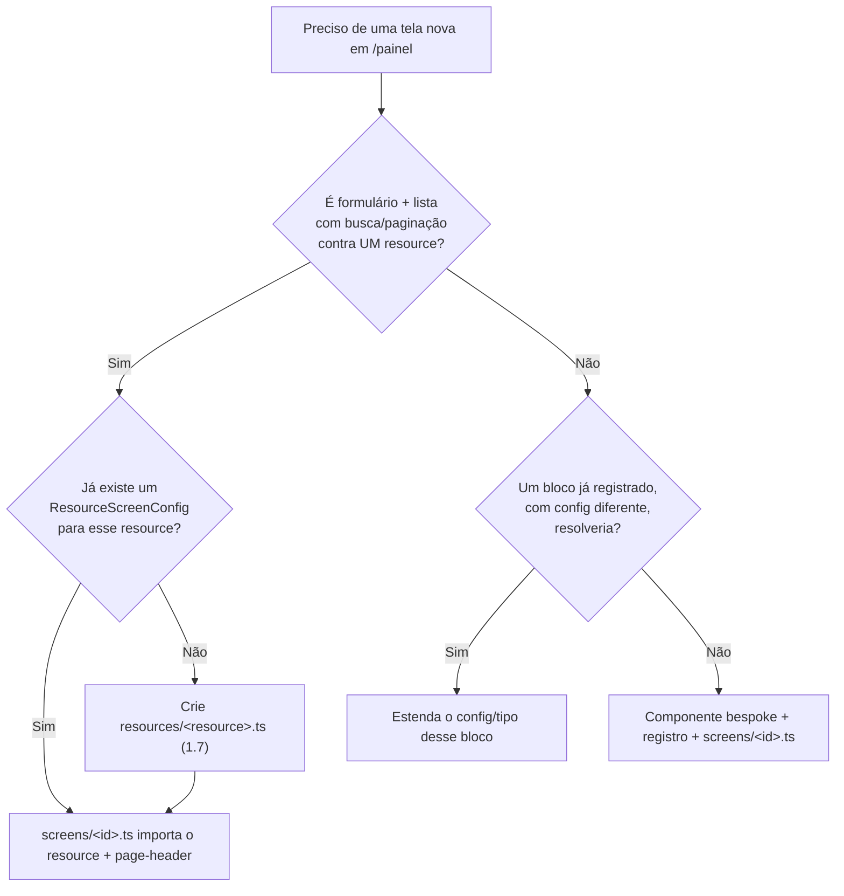

# Screen Engine — Manual

> Para quem é este documento: qualquer pessoa (ou IA) que vá criar, estender ou entender uma tela
> de `/painel` construída sobre o screen-engine do kizuna-core. É o texto completo, com exemplos e
> explicação. O passo a passo executável é a skill `nova-tela-screen-engine`.
>
> **Onde o código mora:** `kizuna-core/src/client/components/screen-engine/`
> (`@kizuna/core/client/components/screen-engine/*`). Os `screens/*.ts` e `resources/*.ts` são
> configs — alguns já vêm de plugins do core; um projeto consumidor pode adicionar os seus.
>
> **Idioma:** este manual é PT porque a fonte original (foco-total) é PT e a maior parte da
> vantagem dele está nos exemplos densos. As outras docs do core são EN.

## Sumário

- [Parte 1 — Arquitetura](#parte-1--arquitetura)
- [Parte 2 — Utilização](#parte-2--utilização)
- [Parte 3 — Limites conhecidos e decisões de design](#parte-3--limites-conhecidos-e-decisões-de-design)
- [Parte 4 — Erros já vividos](#parte-4--erros-já-vividos)
- [Parte 5 — Roadmap](#parte-5--roadmap)
- [Referência rápida](#referência-rápida) (tabelas, para consulta durante uma tarefa)

---

## Parte 1 — Arquitetura

### 1.1 A ideia central

Uma tela de `/painel` é uma lista ordenada de **blocos**. Cada bloco é um nome (string) mais um
saco de props JSON-serializáveis:

```ts
type ScreenBlock = { component: string; props: Record<string, unknown> };
type ScreenConfig = { id: string; blocks: ScreenBlock[] };
```

Um **registro** (`registry.ts`) mapeia esse nome para o componente React de verdade. Um
**resolvedor** (`RenderScreen`) percorre `blocks`, busca cada componente no registro e renderiza
com as `props` daquele bloco. Montar uma tela nova é escrever um objeto, não um arquivo `.tsx`
novo — _quando_ o formato da tela permite.

O motor **nunca** decide regra de negócio. Ele só resolve "qual componente, com quais props". Se
você está tentado a colocar uma função ou um `onClick` dentro de um `props`, pare — esse
comportamento pertence ao componente do bloco, não ao config.

### 1.2 `ScreenConfig` / `ScreenBlock`

`screen-engine/types.ts` (`@kizuna/core/types` re-exporta `ScreenBlock`, `ScreenConfig`,
`ScreenContext`). Não existe `condition`, `onEvent`, nem referência a função. `props` é
`Record<string, unknown>` de propósito — o registro é heterogêneo, não dá para tipar
estaticamente contra "o" formato certo. Consequência prática: ver [3.2](#32-props-não-é-checado).

### 1.3 O registro de componentes — `registry.ts`

```ts
export type RegistryEntry = { component: ComponentType<any>; serverSafe: boolean };

export const SCREEN_COMPONENT_REGISTRY: Record<string, RegistryEntry> = {
  'page-header': { component: PageHeaderBlock, serverSafe: true },
  'resource-screen': { component: ResourceScreen, serverSafe: false },
  // … blocos bespoke registrados pelo core ou pelo projeto consumidor
};
```

Cada bloco aparece aqui exatamente uma vez, nome único, kebab-case. `serverSafe` é metadado para
humanos/IA (Server Component puro vs. `'use client'`) — **não é imposto**: um Server Component
(`RenderScreen`) renderiza um Client Component como filho nativamente.

`ComponentType<any>` e não `<never>`: `never` não é aceito como tipo de elemento JSX, e cada
entrada tem seu próprio formato de props resolvido em runtime. É um `any` consciente.

### 1.4 `RenderScreen` — o resolvedor

É um **Server Component**. Percorre `config.blocks`, resolve cada nome no registro, aplica
`resolveContextRefs(props, context)` e renderiza. Bloco `serverSafe: true` sai pronto no HTML
inicial; só os `'use client'` pagam hidratação. Nome desconhecido → erro explícito na hora. Todo
bloco recebe a `div` de layout externa (`max-w`, padding) pronta.

### 1.5 `createScreenPage` — a fábrica de página

Uma rota do App Router sempre precisa de um `page.tsx`. O de uma tela do motor é uma linha:

```tsx
export default createScreenPage(MINHA_SCREEN);
```

Faz duas coisas: (1) checa `session?.tenant_type === 'ADMIN'`, redireciona para `/painel` (ou
`options.redirectTo`) se não for; (2) monta o `ScreenContext` a partir de `params`/`searchParams`
e renderiza `<RenderScreen config context />`.

**É ADMIN-only, sempre, hoje.** Não há opção "qualquer usuário logado" ou "quem tem a permissão
X". Uma tela não-admin escreve o `page.tsx` à mão — só o check de sessão + `<RenderScreen />`
direto (ver [3.3](#33-createscreenpage-é-admin-only)).

### 1.6 Context — `$params` / `$searchParams` / `$session`

Dentro de qualquer `props`, uma string **exatamente igual** a `"$params.id"`,
`"$searchParams.status"` ou `"$session.tenant_id"` é substituída pelo valor real antes de
renderizar (`resolveContextRefs`, `context.ts`). Recursivo em arrays/objetos. Chave ausente vira
`undefined` silenciosamente — nunca lança. Continua sendo **só dado**: o bloco recebe o valor já
resolvido, nunca uma função para ler a URL. É isto que deixa uma tela escopar por sessão sem uma
função bespoke e sem nada client-controlled vazar para dentro de uma query.

### 1.7 O bloco CRUD genérico — `ResourceScreen`

Prova a hipótese central: "formulário + lista com busca/paginação" vira **puro config**, zero
componente novo por tela. Dois recursos diferentes (`postgrestResources`) renderizados pelo
**mesmo** `ResourceScreen` — a diferença entre as telas é só o `ResourceScreenConfig`.

Por dentro: `useForm` (Formik) para criar/editar a partir de `config.fields`; `useTable` para a
lista a partir de `config.list`; `useResourceOptions` **uma vez** se houver um campo `relation`
(nunca duas — [3.1](#31-um-relation-por-formulário)); cada campo renderizado por `DynamicField`.

```ts
type ResourceScreenConfig = {
  resource: string;             // chave em postgrestResources
  entitySingular: string;       // "categoria" — usado em títulos gerados
  entityPlural: string;
  pageSize?: number;
  orderBy?: string;
  orderDirection?: 'asc' | 'desc';
  searchPlaceholder?: string;
  emptyMessage?: string;
  requireRelationToCreate?: boolean;
  fields: ResourceScreenField[];
  list: ResourceScreenListConfig;
  messages?: ResourceScreenMessages;
};
```

Exemplo (instância de um projeto consumidor):

```ts
export const CATEGORIES_RESOURCE: ResourceScreenConfig = {
  resource: 'categories',
  entitySingular: 'categoria',
  entityPlural: 'categorias',
  orderBy: 'name',
  pageSize: 8,
  searchPlaceholder: 'Buscar por nome, descricao ou slug',
  fields: [
    { name: 'name', label: 'Nome', type: 'text' },
    { name: 'description', label: 'Descricao', type: 'textarea', maxLength: 240 },
    { name: 'active', label: 'Status', type: 'switch', defaultValue: true },
  ],
  list: { primaryField: 'name', secondaryField: 'slug', statusField: 'active', descriptionField: 'description' },
  messages: { saveError: 'Nao foi possivel salvar.', saveSuccess: 'Salvo.' },
};
```

### 1.8 `DynamicField` / `DynamicStepForm` — o campo compartilhado

`ResourceScreen` (Formik) e um step de wizard (`useState` simples) resolvem o mesmo problema —
"renderize estes campos, me avise quando mudarem" — com gerência de estado diferente.
`DynamicField` é o ponto em comum: recebe `value`/`onChange` puro, nunca uma ligação Formik.

`DynamicStepForm` empacota isso para uso **dentro de um step de wizard**: `fields[]` + `values` +
`onChange(name, value)`, carrega as opções de um eventual `relation` do mesmo jeito (mesmo limite
de um `relation` por formulário). Nem todo step deveria virar isso — só os que são "uns campos".
Upload de arquivo, seletor de mapa, rich-text continuam bespoke.

---

## Parte 2 — Utilização

### 2.1 Decidindo o formato da tela



Segunda decisão, independente: **a rota é admin-only?** Se sim → `createScreenPage`. Se não → o
`page.tsx` é escrito à mão.

### 2.2 Exemplo: tela CRUD do zero

Existe um `postgrestResource` `things` e você quer `/painel/things-admin`.

```ts
// resources/things.ts — "como o recurso se edita"
export const THINGS_RESOURCE: ResourceScreenConfig = {
  resource: 'things', entitySingular: 'item', entityPlural: 'itens', orderBy: 'name',
  fields: [
    { name: 'name', label: 'Nome', type: 'text' },
    { name: 'active', label: 'Status', type: 'switch', defaultValue: true },
  ],
  list: { primaryField: 'name', statusField: 'active' },
};
```

```ts
// screens/things-admin.ts — "o que aparece nesta página, nesta ordem"
export const THINGS_ADMIN_SCREEN: ScreenConfig = {
  id: 'things-admin',
  blocks: [
    { component: 'page-header', props: { title: 'Itens', backHref: '/painel' } },
    { component: 'resource-screen', props: { config: THINGS_RESOURCE } },
  ],
};
```

```tsx
// app/painel/things-admin/page.tsx
import { createScreenPage } from '@kizuna/core/client/components/screen-engine/screen-page';
import { THINGS_ADMIN_SCREEN } from '.../screens/things-admin';
export default createScreenPage(THINGS_ADMIN_SCREEN);
```

Três arquivos, nenhum JSX novo. Rode o checklist de [2.8](#28-checklist).

### 2.3 Exemplo: bloco bespoke registrado

Um formato que não é "formulário + lista" (uma árvore, um dashboard) continua sendo um componente
próprio — o motor só **compõe** a página:

```ts
// registry.ts
'thing-tree': { component: ThingTree, serverSafe: false },
// screens/thing-tree.ts
export const THING_TREE_SCREEN: ScreenConfig = {
  id: 'thing-tree',
  blocks: [
    { component: 'page-header', props: { title: 'Árvore', backHref: '/painel' } },
    { component: 'thing-tree', props: {} },
  ],
};
```

`ThingTree` não sabe que está "dentro do motor" — recebe `{}` de props e funciona como antes.

### 2.4 Um bloco, duas telas, dois configs

Um bloco de listagem bespoke pode servir duas telas com "donos" diferentes só trocando o
`config` (título, ação por linha, filtro default, botão de criar). Zero duplicação de JSX de card
nem de lógica de busca/paginação — a mesma prova de conceito de `ResourceScreen`, estendida para
um bloco que não é CRUD simples.

### 2.5 `resources/` vs `screens/`

`resources/*.ts` = "como o recurso X se edita" (dono de UM `postgrestResource`, reutilizável
entre telas). `screens/*.ts` = "o que aparece nesta página, nesta ordem". Se outra tela quiser um
`resource-screen` para o mesmo recurso, importa o `ResourceScreenConfig` em vez de duplicar
`fields[]`.

`list` (`ListBlock`, genérico) não tem config em `resources/` — cada tela define seu
`displayConfig` (ícone como string, `singularName`, `fields` com `FieldFormat` declarativo,
`visibleFields`) inline em `screens/*.ts`, porque isso é apresentação daquela tela.

### 2.6 Vocabulário de campo (`ResourceScreenField`)

| `type` | Quando | Props extras |
|---|---|---|
| `text` | texto curto | `placeholder?` |
| `textarea` | texto longo | `placeholder?`, `maxLength?`, `rows?` |
| `switch` | booleano | `defaultValue?` |
| `relation` | opções de **outro** `postgrestResource` | `optionsResource`, `optionsLabelField?` (default `"name"`), `optionsFilter?` |
| `select` | opções **fixas**, enum fechado do domínio | `options: {value,label}[]` |

`relation` quando as opções vêm de uma tabela (mudam sem redeploy); `select` quando é um enum
`CHECK` do banco. **Um `relation` por formulário** — ver [3.1](#31-um-relation-por-formulário).

### 2.7 Contadores reais (`stat-cards`)

Cada card conta linhas de um `postgrestResource` via `useTable({ pageSize: 1, filters })` lendo
`total` (`Content-Range`) — **nunca** uma agregação do PostgREST (`count()`), que pode estar
desabilitada no deployment (`PGRST123`). `resource` é qualquer recurso listável, não precisa de um
recurso de contagem dedicado.

### 2.8 Checklist antes de dar como pronto

1. **`props` bate com a assinatura do componente registrado?** `tsc` não valida — confira à mão
   se o bloco espera `{ config: {...} }` ou props soltos.
2. **A rota precisa mesmo ser ADMIN-only?** Se não, não use `createScreenPage`.
3. **Nenhuma função/JSX dentro de `props`** — só dado serializável.
4. `npx tsc --noEmit`, `eslint`, `prettier --write`, `npm run build` (confirme a rota na tabela do build).
5. Teste a rota de verdade — sem sessão, um `curl` deve dar redirect, nunca 500.

### 2.9 N resources num bloco bespoke (`useResourceMap`)

`useResourceOptions` = "1 resource, 1 combobox". Um bloco **bespoke** que precisa de N resources
independentes ao mesmo tempo usa `useResourceMap` (`@kizuna/core/client`) — não N `useEffect`/fetch
manuais nem chamadas encadeadas.

- **Cada campo de `data` chega assim que a entry responde** — sem `Promise.all` gating. Renderize
  `data.a` antes de `data.b` estar pronto.
- **`map` extrai um campo por entry pra um array plano** — formato certo pra "lista de labels",
  não pra "linha inteira como objeto". Um bloco que precisa da linha completa continua com
  `useResourceOptions` (devolve `T[]`).
- Sem grafo de dependência: combobox filtrado por outro campo continua sendo `useResourceOptions`
  reagindo a um `filter` que muda.

---

## Parte 3 — Limites conhecidos e decisões de design

### 3.1 Um `relation` por formulário

`ResourceScreen` e `DynamicStepForm` aceitam no máximo um campo `type: 'relation'`. **Rules of
hooks**: suportar N relações exigiria chamar `useResourceOptions` um número variável de vezes.
Uma tela com mais de uma relação é um formato genuinamente diferente — registre um componente
próprio. `useResourceMap` **não** resolve isto (ele extrai 1 campo por entry, não a linha
inteira).

### 3.2 `props` não é checado contra a assinatura do bloco

`ScreenBlock.props` é `Record<string, unknown>` — `tsc` não sabe (nem pode, o registro é
heterogêneo) se o formato bate. Errar isso não quebra o build, só em runtime. É o item 1 do
checklist por isso.

### 3.3 `createScreenPage` é ADMIN-only

Gate fixo `tenant_type === 'ADMIN'`, sem opção "qualquer sessão" ou "permissão X". Uma segunda
tela não-admin seria o gatilho para adicionar `requiredAuth: 'session' | 'admin'` (ou
`requiredPerm`) em vez de repetir o `page.tsx` manual.

### 3.4 Sem campo condicional

`ResourceScreenField` não tem `visibleWhen`/`dependsOn` — um campo sempre renderiza. O código que
chama o form decide não enviar o valor irrelevante.

### 3.5 Por que ainda existe um `page.tsx` por rota

Cogitado e descartado um catch-all (`/painel/[...slug]`). Três razões: (1) App Router roteia por
arquivo; (2) `/painel` tem páginas que não são screen-engine (wizards, dashboard) — um catch-all
cria ambiguidade; (3) o ponto de mapear o sistema é uma rota ser encontrável por caminho de
arquivo. O corte de boilerplate foi só no que sobrava: `createScreenPage` faz gate + context, a
página é uma linha.

---

## Parte 4 — Erros já vividos

| Sintoma | Causa | Onde |
|---|---|---|
| `ComponentType<never>` não aceito como JSX | Registro tipado `<never>` em vez de `<any>` (heterogêneo por natureza) | [1.3](#13-o-registro-de-componentes--registryts) |
| Artigo/gênero errado numa mensagem genérica | Tentativa de adivinhar gênero por string — sempre falsa; use texto neutro, `messages` sobrescreve | — |
| `useResourceOptions` dentro de `stats.map()` | Hook chamado número variável de vezes quebra rules of hooks — um componente por card | [2.7](#27-contadores-reais-stat-cards) |
| `Cannot read properties of undefined (…)` em runtime, `tsc` limpo | Props soltos onde o bloco esperava `{ config: {...} }` | [3.2](#32-props-não-é-checado) |
| Tela não-admin travaria para usuário comum | `createScreenPage` aplica gate ADMIN — faça o gate à mão | [3.3](#33-createscreenpage-é-admin-only) |
| `stat-cards` sempre em 0, sem erro visível | `select: 'count'` (nem é sintaxe válida) contra deployment com agregação desabilitada (`PGRST123`); hook descartou o erro. Fix: contar via `useTable` `total` | [2.7](#27-contadores-reais-stat-cards) |
| `Only plain objects can be passed to Client Components` em runtime, `tsc` limpo | `props` de um bloco `'use client'` continha ícone (`ComponentType`) / `formatter` (função). Fix: ícone → string (`ICON_MAP`), formatter → `FieldFormat` declarativo | [1.4](#14-renderscreen--o-resolvedor) |

Ao descobrir um erro novo, adicione uma linha aqui **e** na versão curta da skill/doc de referência
rápida do projeto consumidor.

---

## Parte 5 — Roadmap

Objetivo de longo prazo: configurar uma tela por UI, não por PR. O motor já cumpre "renderizar a
partir de config puro"; falta "editar esse config sem abrir um editor de código". Dois
pré-requisitos:

1. **Schema por bloco no registro.** Hoje só `{ component, serverSafe }`. Uma UI de configuração
   precisa de um Zod/JSON-Schema por entrada — resolveria [3.2](#32-props-não-é-checado) de graça.
2. **Camada de persistência.** Configs vivendo numa tabela `screen_configs` (os `.ts` viram
   seed/fallback). `RenderScreen`/`resolveContextRefs` já tratam config como dado puro — aditivo.

---

## Referência rápida

### Peças

| Peça | Arquivo (`@kizuna/core/client/components/screen-engine/…`) |
|---|---|
| Tipos (`ScreenConfig`/`ScreenBlock`/`ScreenContext`) | `types.ts` |
| Registro de componentes | `registry.ts` |
| Renderizador (Server Component) | `render-screen.tsx` |
| Tipos do bloco CRUD | `resource-screen-types.ts` / `@kizuna/core/types` |
| Configs de recurso (`ResourceScreenConfig`, 1 por recurso) | `resources/*.ts` |
| Configs de tela (1 por rota) | `screens/*.ts` |
| Bloco CRUD genérico (client) | `../resource-screen.tsx` |
| Campo único (framework-agnóstico) | `../dynamic-field.tsx` |
| Form dinâmico para step de wizard | `../dynamic-step-form.tsx` |
| Bloco de cabeçalho (server-safe) | `../page-header-block.tsx` |
| Bloco de listagem genérico | `../list-block.tsx` |
| Context (`$params`/`$searchParams`/`$session`) | `context.ts` |
| Fábrica de `page.tsx` (gate ADMIN + context) | `screen-page.tsx` |

**DOIS "resource" diferentes, não confundir:**

- **`postgrestResources`** (registry do projeto consumidor) — o `ResourceConfig` real da API:
  `table`, `select`, `mapInput`/`mapOutput`. **Nunca** duplicado dentro de `screen-engine/` — um
  bloco que precisa do shape importa `postgrestResources[nome]`.
- **`screen-engine/resources/*.ts`** (`ResourceScreenConfig`) — config de UI só do bloco
  `resource-screen` (form fields, `list.*`, `messages`). Referencia o recurso só pelo nome
  (`resource: 'categories'`).

### Regras

- `props` de um bloco é só dado serializável. Nunca função nem JSX. Comportamento vive no componente.
- Um `relation` por formulário (`ResourceScreen`/`DynamicStepForm`).
- Bloco bespoke com N resources independentes → `useResourceMap`, não N `useResourceOptions`.
- `createScreenPage` é ADMIN-only, sempre.
- `props` NÃO é checado contra a assinatura do componente — confira à mão.
- Contagem real nunca via agregação do PostgREST — `useTable({ pageSize: 1 })` + `total`.
- Sem campo condicional (`visibleWhen`) ainda.
- Uma listagem sem `fixedFilters` mostra TODOS os tenants — uma tela "minha" precisa de
  `fixedFilters: { tenant_id: '$session.tenantId' }` **e** a `page.tsx` passando
  `context={{ session: { tenantId: session.tenant_id } }}`.
